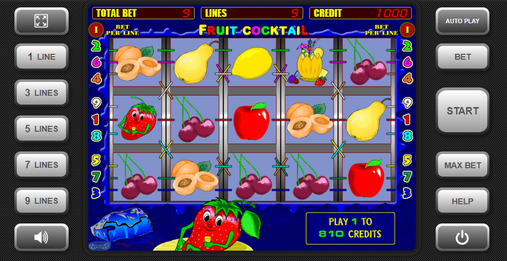

# Simple test of Fruit coctal slot machine
 

Під час тестування слот-машини необхідно фіксувати та розраховувати ряд ключових показників і статистичних метрик, щоб переконатися у її коректній роботі, відповідності заявленим характеристикам та чесності. Ось основні з них:

## 1. Основні фінансові показники:
Загальна сума ставок (Total Wagered): Сума всіх грошей, поставлених гравцями протягом тестового періоду.
Загальна сума виграшів (Total Won): Сума всіх грошей, виплачених гравцям у вигляді виграшів.
Чистий дохід казино (Net Revenue / Gross Gaming Revenue - GGR): Різниця між загальною сумою ставок та загальною сумою виграшів (Total Wagered - Total Won).

## 2. Показники повернення гравцеві (RTP):
Фактичний RTP (Actual RTP): Розраховується як (Total Won / Total Wagered) * 100%. Цей показник показує фактичний відсоток повернення гравцям за тестовий період. Його слід порівнювати з теоретичним RTP.
Теоретичний RTP (Theoretical RTP): Заздалегідь розрахований математичний показник повернення на основі структури барабанів, таблиці виплат та ймовірностей випадання символів. Фактичний RTP повинен наближатися до теоретичного при достатньо великій кількості тестових спинів.
3. Показники волатильності (дисперсії):

Стандартне відхилення виграшів (Standard Deviation of Wins): Міра розкиду розмірів виграшів відносно середнього виграшу. Високе стандартне відхилення свідчить про високу волатильність (рідкі, але великі виграші), низьке - про низьку волатильність (часті, але невеликі виграші).
Дисперсія виграшів (Variance of Wins): Квадрат стандартного відхилення. Також характеризує розкид виграшів.
Коефіцієнт варіації (Coefficient of Variation): Відношення стандартного відхилення до середнього виграшу. Допомагає порівнювати волатильність різних ігор.
Максимальний виграш (Maximum Win): Найбільший виграш, зафіксований під час тестування.
Частота виграшів (Hit Frequency): Відсоток спинів, які принесли гравцю хоча б мінімальний виграш (Кількість виграшних спинів / Загальна кількість спинів) * 100%.

## 4. Показники бонусних функцій:
Частота випадання бонусних символів (Bonus Trigger Frequency): Відсоток спинів, під час яких було активовано бонусну гру (Кількість активацій бонусу / Загальна кількість спинів) * 100%.
Середній виграш у бонусній грі (Average Win per Bonus): Загальна сума виграшів у всіх бонусних іграх / Кількість активацій бонусу.
Внесок бонусних ігор у загальний RTP (Bonus Contribution to RTP): Відсоток від загального RTP, який забезпечується виграшами в бонусних іграх.

## 5. Розподіл виграшів:
Розподіл частоти виграшів за розмірами (Win Frequency Distribution by Size): Статистика того, як часто трапляються виграші різних розмірів (наприклад, виграші менше ставки, виграші в 2-5 разів більше ставки, великі виграші тощо).
Розподіл виграшів за символами та комбінаціями (Win Distribution by Symbols and Combinations): Аналіз того, які символи та комбінації найчастіше приносять виграші та який їхній сумарний внесок у загальний виграш.

## 6. Показники прогресивного джекпоту (якщо є):
Частота виграшу джекпоту (Jackpot Hit Frequency): Як часто випадає джекпот.
Середній розмір джекпоту (Average Jackpot Size): Середня сума виграного джекпоту.
Внесок джекпоту в загальний RTP (Jackpot Contribution to RTP): Відсоток від загального RTP, який забезпечується виплатами джекпоту.

## 7. Інші важливі показники:
Середня тривалість ігрової сесії (Average Session Length): Середня кількість спинів або час, проведений гравцем за однією сесією.
Середня ставка на спін (Average Bet per Spin): Середня сума, яку гравець ставить за один спін.
Максимальна та мінімальна ставка (Maximum and Minimum Bet): Перевірка відповідності заявленим лімітам ставок.
Час затримки (Latency): Час між дією гравця (натисканням кнопки "пуск") та відображенням результату.
Помилки та збої (Errors and Bugs): Фіксація будь-яких непередбачених помилок у роботі гри.
Процес тестування зазвичай включає:
